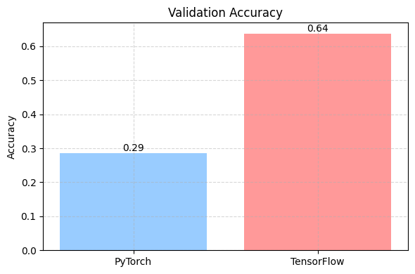
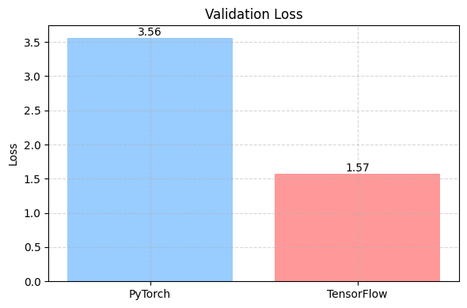
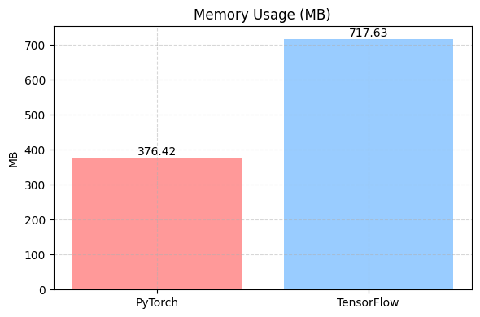
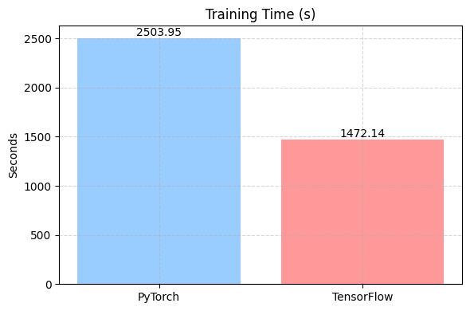
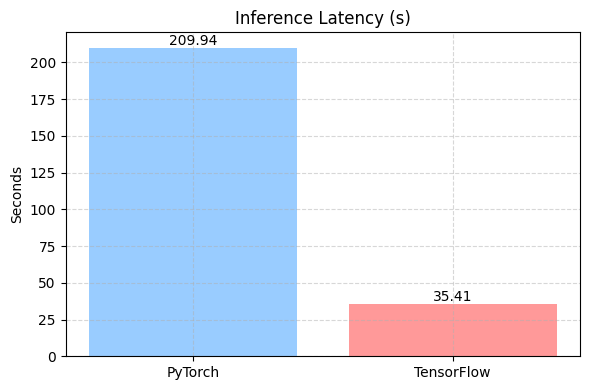
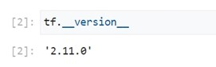
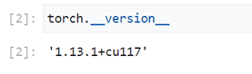

# PyTorch → TensorFlow Model Migration and Framework Performance Comparison Report

## Contents
- [1. Task Overview](#1-task-overview)
- [2. Migration Strategy Design](#2-migration-strategy-design)  
  - [2.1 Fine-tuning Strategy](#21-fine-tuning-strategy)  
    - [2.1.1 Data Preprocessing](#211-data-preprocessing)  
    - [2.1.2 Model Architecture Design](#212-model-architecture-design)  
    - [2.1.3 Hyperparameter Configuration](#213-hyperparameter-configuration)  
    - [2.1.4 Evaluation Metrics](#214-evaluation-metrics)  
  - [2.2 Framework Comparison](#22-framework-comparison)
- [3. Difference Analysis](#3-difference-analysis)
- [4. Pros, Cons, and Recommendations](#4-pros-cons-and-recommendations)
- [5. Subtasks Report](#5-subtasks-report)  
  - [Task 1.1: Vertex AI Setup and User Experience](#task-11-vertex-ai-setup-and-user-experience)  
  - [Task 1.2: tf.data Pipeline Optimization Strategies](#task-12-tfdata-pipeline-optimization-strategies)  
  - [Task 1.3: Model Saving and Version Management Strategy](#task-13-model-saving-and-version-management-strategy)
---

## 1. Task Overview

This project migrates a pretrained ResNet50 model from **PyTorch to TensorFlow**, aiming to achieve **functional migration**, **performance comparison**, and **deployment readiness** while maintaining consistent architecture and training configuration.

While PyTorch is commonly used for research and experimentation, TensorFlow offers notable advantages in deployment and engineering. This project evaluates both frameworks on the Google Cloud Vertex AI platform to guide future development.

---

## 2. Migration Strategy Design

### 2.1 Fine-tuning Strategy

#### 2.1.1 Data Preprocessing

This task uses the public image classification dataset [`oxford_flowers102`](https://www.tensorflow.org/datasets/catalog/oxford_flowers102), which includes 102 categories of flower images:

- Dataset split: 80% for training, 20% for validation  
- Preprocessing steps:
  - **Resizing**: `resize()` to 224×224 uniform input
  - **Normalization**: `preprocess_input()` with ImageNet mean/std
  - **Augmentation**: `shuffle` + `repeat` + `batch` + `prefetch`
  - **Label casting**: ensure integer type using `cast()`

#### 2.1.2 Model Architecture Design

- Base network: `ResNet50(include_top=False, weights="imagenet")`  
- Custom classifier head:
  ```text
  GlobalAveragePooling2D
  Dense(128, activation='relu')
  Dropout(0.5)
  Dense(102, activation='softmax')
  ```
- The backbone is frozen; only the classification head is trainable.

#### 2.1.3 Hyperparameter Configuration

| Hyperparameter     | Value      |
|--------------------|---------|
| Batch Size         | 32      |
| Learning Rate      | 1e-3    |
| Epochs             | 10      |
| Optimizer          | Adam    |
| Buffer Size (TF)   | 1000    |

#### 2.1.4 Evaluation Metrics

| Metric             | Description                                                                 |
|--------------------|-----------------------------------------------------------------------------|
| Training Time       | Measured using `time.time()` (on Vertex AI)                                 |
| Memory Usage        | PyTorch uses `torch.cuda.max_memory_allocated()`; TF uses `psutil`          |
| Inference Latency   | Total time measured during `evaluate()`                                     |
| Validation Loss     | Manually computed in PyTorch; automatically returned in TF via `evaluate()` |
| Validation Accuracy | PyTorch uses `torch.max()`; TF returns `accuracy` from `evaluate()`         |


### 2.2 Framework Comparison

#### Data Preprocessing Interface Comparison

| Item               | PyTorch                                             | TensorFlow                                       |
|--------------------|-----------------------------------------------------|--------------------------------------------------|
| Dataset Loading     | `torchvision.datasets.ImageFolder` + custom path   | `tensorflow_datasets.load("oxford_flowers102")` |
| Augmentation        | `transforms.Resize`, `transforms.ToTensor`         | `tf.image.resize`, `tf.cast`, `preprocess_input`|
| Batch Management    | `DataLoader(..., shuffle=True)`                    | `tf.data.Dataset.map().batch().prefetch()`      |

#### Model Implementation Interface Comparison

| Item               | PyTorch                                | TensorFlow/Keras                                   |
|--------------------|-----------------------------------------|----------------------------------------------------|
| Pretrained Loading  | `models.resnet50(pretrained=True)`     | `keras.applications.ResNet50(weights="imagenet")`  |
| Add Classifier Head | `nn.Sequential([...])`                 | `keras.Sequential([...])`                          |
| Training Loop       | `for epoch in range(...)`              | `model.fit()`                                      |

#### Model Evaluation Interface Comparison

| Item               | PyTorch                                             | TensorFlow                                   |
|--------------------|-----------------------------------------------------|----------------------------------------------|
| Inference Mode      | `base_model.eval()` + manual loop                  | `model.evaluate()`                           |
| Accuracy/Loss       | `CrossEntropyLoss()`, `torch.max()`                | `'sparse_categorical_crossentropy'`, `accuracy` |
| Model Saving        | `torch.save(model.state_dict())`                   | `tf.saved_model.save(model, path)`           |

---

## 3. Difference Analysis

<div align="center">
  
  
</div>

<div align="center">
  
  
  
</div>

<p align="center">
  <b>Figure 1:</b> Performance comparison between TensorFlow and PyTorch across different metrics. Red = better, Blue = worse.
</p>

| Metric             | Winner       | Notes                                         |
|--------------------|--------------|-----------------------------------------------|
| Validation Loss     | TensorFlow   | Better convergence and generalization         |
| Validation Accuracy | TensorFlow   | Significantly higher accuracy (0.64 vs 0.29)  |
| Training Time       | TensorFlow   | ~40% faster due to efficient data pipeline    |
| Inference Latency   | TensorFlow   | ~80% lower latency, deployment-friendly       |
| Memory Usage        | PyTorch      | More lightweight, lower resource usage        |

**Summary**: TensorFlow leads in **accuracy**, **speed**, and **deployment readiness**, with only memory usage being slightly less efficient—likely due to internal tensor caching or graph overhead. Overall, **TensorFlow is better suited** for this task.

---

## 4. Pros, Cons, and Recommendations

Based on the results, **TensorFlow is preferred** for tasks on Google Cloud.

### TensorFlow Advantages

- Cloud deployment and distributed training support  
- Superior training/inference performance for production  
- Standardized API design for teamwork and reproducibility  
- Broad deployment options (TFLite, TF.js, SavedModel, TF Serving)

### PyTorch Advantages

- Flexible debugging and dynamic computation  
- Lower memory footprint, suitable for local environments  
- Rapid prototyping and research-friendly  
- Strong support for open-source model reproduction
  
---

## 5. Subtasks Report

### Task 1.1: Vertex AI Setup and User Experience

<div align="center">
  
  
  <b>Figure 2:</b> Environment setup for TensorFlow (left) and PyTorch (right).
</div>

#### Experience Notes

Using Vertex AI for the first time was challenging but insightful. Vertex AI’s environment setup and model integration are highly suitable for pipeline-based deep learning development.

Understanding Google Cloud's ecosystem was essential — particularly in code execution, training orchestration, storage, pipelines, and model registration. Although full production deployment wasn’t completed, it clarified key MLOps requirements in real-world engineering.

What stood out was Vertex AI’s **automatic dependency handling** for TensorFlow. After failing to reproduce environments locally, I appreciated the platform’s convenience. There were minor compatibility issues on the PyTorch side (with NumPy), resolved via version rollback.

Finally, I attempted to build an end-to-end MLOps pipeline (with KFP, pipeline components, model registry), but was blocked by permission issues. I instead completed training locally on TensorFlow 2.11.0.

---

### Task 1.2: `tf.data` Pipeline Optimization Strategies

- Dataset loading: `tfds.load("oxford_flowers102")`
- Key operations:
  - `tf.image.resize()` → Standardize image size  
  - `tf.keras.applications.resnet50.preprocess_input()` → Normalize  
  - `map()` → Parallel preprocessing  
  - `shuffle()` → Increase data diversity  
  - `repeat()` → Multi-epoch support  
  - `batch()` → Batching for GPU efficiency  
  - `prefetch()` → Asynchronous loading

#### Summary of Benefits

Compared to ad-hoc methods, `tf.data` pipelines offer caching, prefetching, and parallelization — improving GPU utilization and memory efficiency. It also provides a standardized and reusable preprocessing workflow, suitable for enterprise data pipelines.

---

### Task 1.3: Model Saving and Version Management Strategy

#### Model Saving Format Comparison

| Property        | SavedModel                          | HDF5                                  |
|------------------|--------------------------------------|----------------------------------------|
| Structure         | Directory-based                     | Single `.h5` file                      |
| Content Saved     | Model architecture, weights, optimizer, custom layers, graph | Architecture, weights, optimizer      |
| Usage             | Cloud deployment, TF Serving, Java/C++ export | Local development, small projects     |
| Limitation        | Larger file size                    | No support for subclassed models, incompatible with TF Serving |

---

#### Version Control Strategy

- **Parameter Management**: Hyperparameters like `batch_size`, `learning_rate`, `epochs` are stored in `.json` configs. The training script saves the config for reproducibility.
- **Directory Structure**: Weight files are stored by experiment name; `README.md` inside for metadata.
- **Git Strategy**:
  1. Initialize and commit all code to Git  
  2. Create a separate branch per experiment (e.g., `exp1_resnet50_bs32_lr1e-3_e10`)  
  3. Use `git tag` for version tracking and easy rollback


