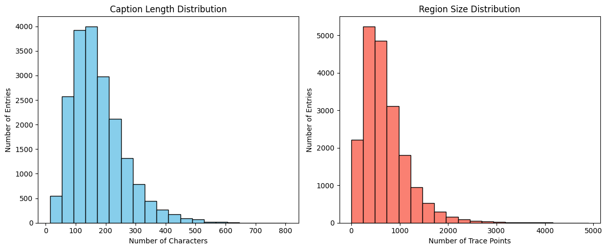
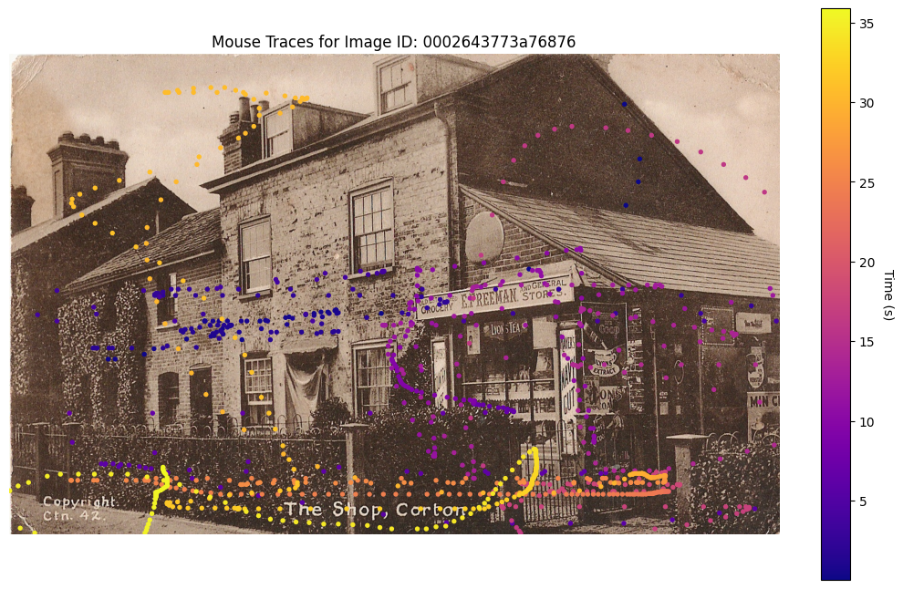
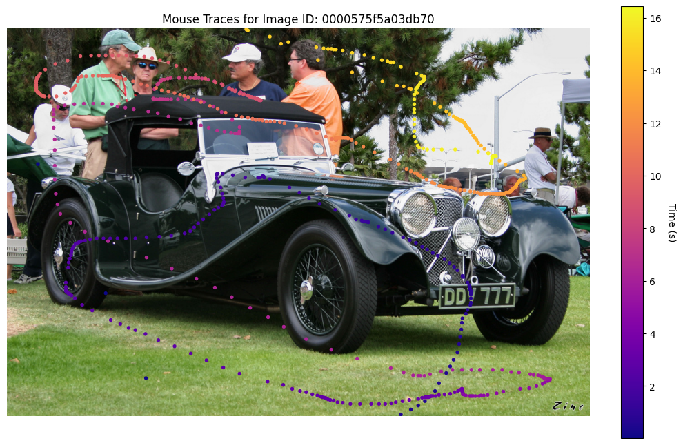
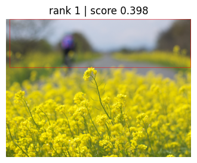
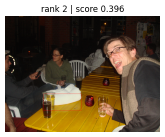
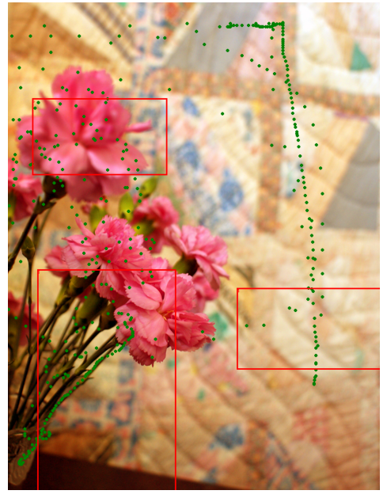
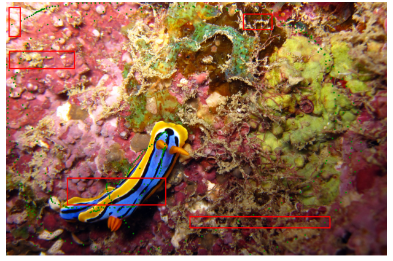
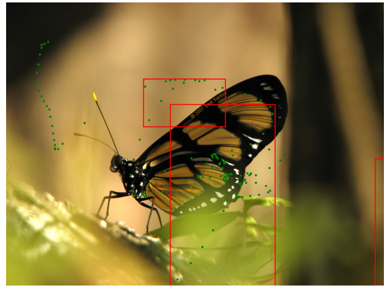

# Technical Report on a Prototype System for Graphic Retrieval Based on OID Localized Narratives

This project builds a text-image retrieval prototype system based on the **Open Images Dataset V7 (Localized Narratives)**, enabling the functionality of retrieving relevant image regions based on textual queries.

---

## Table of Contents
- [1. Dataset](#1-dataset)  
  - [1.1 Dataset Sampling](#11-dataset-sampling)  
  - [1.2 Dataset Cleaning](#12-dataset-cleaning)  
  - [1.3 Dataset Splitting (Optional)](#13-dataset-splitting-optional)  
  - [1.4 Dataset Visualization & Analysis](#14-dataset-visualization--analysis)  
- [2. Multimodal Embedding Research and Model Selection](#2-multimodal-embedding-research-and-model-selection)  
  - [2.1 Multimodal Embedding Models](#21-multimodal-embedding-models)  
    - [2.1.1 CLIP](#211-clip)  
    - [2.1.2 ALIGN](#212-align)  
  - [2.2 Model Selection](#22-model-selection)  
- [3. Evaluation Metrics](#3-evaluation-metrics)  
  - [3.1 Overview of Metrics](#31-overview-of-metrics)  
  - [3.2 Metric Definitions and Calculations](#32-metric-definitions-and-calculations)  
- [4. Experiments](#4-experiments)  
  - [4.1 Text Feature Extraction](#41-text-feature-extraction)  
  - [4.2 Retrieval System](#42-retrieval-system)  
  - [4.3 Evaluation Results](#43-evaluation-results)  
- [5. Conclusion and Outlook](#5-conclusion-and-outlook)  

---

## 1. Dataset

The Open Images Dataset, released by Google in 2016 and updated to V7, is one of the largest publicly available multi-label image datasets. It contains over 9 million images across thousands of categories, including:

- **Image-level labels**: Semantic annotations for the entire image.
- **Bounding boxes**: Annotated locations of objects within the image.
- **Segmentation masks**: Pixel-level segmentation for semantic/instance segmentation.
- **Visual relationships**: Descriptions of inter-object relationships (e.g., "riding a horse").
- **Localized Narratives**: Multimodal data combining image, narration, and pointing trajectory.
- **Facial annotations**: Face regions with attributes like age, gender, emotion (in some versions).
- **Hierarchies and attributes**: Category hierarchies and properties like color/material.

**Localized Narratives** is a key extension of Open Images V7, combining **seeing** (image), **saying** (spoken text), and **pointing** (user trajectory) into a synchronized multimodal dataset. Each record includes:

- `image_id`: Unique identifier of the image  
- `caption`: Full narration text  
- `time_caption`: Segmented utterances with timestamps  
- `traces`: User pointing coordinates (x, y, t) during each utterance
 
### 1.1 Dataset Sampling

The complete Localized Narratives dataset contains:
- 507,444 training images  
- 41,691 validation images  
- 126,020 test images

Due to resource constraints, only the **first partition of the training set** is used for experimentation.

- This partition contains 50,980 JSONL entries.
- After matching `image_id`s with CSV metadata and downloading, a total of **19,354 valid images** were obtained.

### 1.2 Dataset Cleaning

The JSONL files were cleaned based on the actual available image set:

- **Valid Entry Filtering**: Only entries corresponding to successfully downloaded image files were retained.
- **Trace Time Filtering**: Only keep trace points within the timestamp range of the corresponding `timed_caption`.
- **Out-of-Bounds Removal**: Any trace point falling outside the image boundaries was removed.
- **Empty Traces Handling**: For utterances with no valid trace points after filtering, `traces` was set to an empty list to maintain structure.
- **Result Saving**: Cleaned entries were saved as `filtered_original_train.jsonl`.

### 1.3 Dataset Splitting (Optional)

Due to restricted access to the original validation and test sets, the valid 19,354 images were randomly split based on the full dataset ratio (507,444:41,691:126,020 ≈ 75:6:19).

Final split:
- **Training Set**: 14,515  
- **Validation Set**: 1,161  
- **Test Set**: 3,678  

### 1.4 Dataset Visualization & Analysis

  

  <b>Figure 1:</b> Histogram of caption lengths (left) and number of trace points (right)

From the results:
- **Left**: Captions range from ~20 to ~800 characters, peaking at ~150 characters.
- **Right**: Trace points range from tens to 5,000, with most between 400–900 points (peak at ~500–600).

Both follow an approximately **normal distribution**, with a **mean ratio of ~1:3.5** between caption length and trace points, i.e., one word corresponds to ~3.5 trace points.

  
  

  <b>Figure 2:</b> Heatmaps of trace points over time

---

## 2. Multimodal Embedding Research and Model Selection

### 2.1 Multimodal Embedding Models

Multimodal embedding models aim to project image and text information into a shared vector space, enabling cross-modal retrieval.

#### 2.1.1 CLIP

CLIP, proposed by OpenAI, was trained using hundreds of millions of image-text pairs via contrastive learning to learn powerful image-text alignment.

CLIP uses an image-text pair as a positive sample and unrelated pairs as negative samples. It employs a contrastive loss (InfoNCE) to **maximize similarity for positives** and **minimize similarity for negatives** in the embedding space. Images are typically encoded with a Vision Transformer (ViT) or ResNet, while text is encoded using a Transformer. Both are projected into a shared multimodal embedding space.

**Advantages of CLIP**:
- No need for region-level alignment — image-text pairs suffice.
- Large-scale pretraining enables strong cross-modal and zero-shot capabilities.
- Lightweight and generalizable for various tasks.

In retrieval tasks, both image and text embeddings lie in the same space, allowing:
- **Text-to-image** retrieval: embedding the query and ranking image embeddings by cosine similarity.
- **Image-to-text** retrieval: vice versa.

#### 2.1.2 ALIGN

ALIGN, proposed by Google, is a large-scale multimodal pretraining method that further scales contrastive learning with noisy web data.

Like CLIP, ALIGN uses a contrastive framework, but its **key feature** is the use of noisy image-text pairs from web-scale data. It uses:
- **EfficientNet** for image encoding  
- **BERT** for text encoding  
Then projects both into a shared vector space and applies contrastive loss.

**Advantages of ALIGN**:
- Trained on extremely large datasets, improving diversity and robustness.
- Highly tolerant to noise, reducing the cost of data cleaning.
- More scalable across languages and domains, enabling multilingual and zero-shot retrieval.

In retrieval, ALIGN demonstrates strong performance on large-scale search tasks, even in complex or multilingual scenarios.

### 2.2 Model Selection

This project uses **CLIP** due to its lightweight nature and better suitability for local experiments.

---

## 3. Evaluation Metrics

### 3.1 Overview of Metrics

This system uses multiple metrics to comprehensively evaluate retrieval performance:

- **Precision@K (P@K)**: Proportion of correct results in the top-K retrieved.
- **Recall@K (R@K)**: Whether at least one ground truth is found in top-K.
- **Mean Average Precision (MAP)**: Measures retrieval ranking quality.
- **Normalized Discounted Cumulative Gain (NDCG)**: Reflects ranking position of relevant results.
- **PointCoverage@K**: Measures how well the predicted region covers ground truth trace points.

Since the ground truth in this task is represented by **mouse trace points**, conventional image-text metrics are insufficient. Thus, **PointCoverage@K** is the primary evaluation metric — measuring the proportion of GT points covered by predicted regions.

### 3.2 Metric Definitions and Calculations

#### 3.2.1 Precision@K (P@K)

Proportion of predicted regions (among Top-K) with IoU above a threshold (default 0.5):

$$ P@K = \frac{\text{number of correct regions in Top-K}}{K} $$

#### 3.2.2 Recall@K (R@K)

Checks if **at least one** correct region is retrieved in Top-K (IoU ≥ threshold):

$$
R@K = 
\begin{cases}
1 & \text{if ≥ 1 correct in Top-K} \\\\
0 & \text{otherwise}
\end{cases}
$$

#### 3.2.3 Mean Average Precision (MAP)

Average of reciprocal ranks of the first correct result over all queries:

$$
MAP = \frac{1}{N} \sum_{i=1}^{N} \frac{1}{rank_i}
$$

Where $rank_i$ is the position (1-based) of the first correct result.

#### 3.2.4 Normalized Discounted Cumulative Gain (NDCG)

Measures ranking quality by assigning higher rewards to top-ranked relevant results:

$$
DCG@K = \sum_{i=1}^{K} \frac{rel(i)}{\log_2(i+1)}
$$

Assuming only one relevant result (ideal DCG = 1):

$$
NDCG@K = \frac{DCG@K}{IDCG@K}
$$

#### 3.2.5 PointCoverage@K

Proportion of ground truth trace points covered by the predicted region(s) among Top-K:

$$
PointCoverage@K = \max_{r \leq K} \frac{\text{number of covered GT points}}{\text{Total GT points}}
$$

---
 
## 4. Experiments

### 4.1 Text Feature Extraction

To obtain vector representations of captions, we use **Sentence-BERT (all-MiniLM-L6-v2)** as the text encoder. It takes caption text as input and outputs a **384-dimensional contextual embedding**. To align with the image region embedding dimension, we project the 384-d vector to 512-d using a linear layer.

Details:
- **Model loading**: via HuggingFace's `AutoTokenizer` and `AutoModel`.
- **Mean pooling**: apply mask-based mean pooling over token embeddings.
- **Projection layer**: a 384 → 512 linear transformation (without bias).
- **Normalization**: L2 normalization applied for cosine similarity computation.

### 4.2 Retrieval System

The system uses a **Caption → Image Region** retrieval pipeline.

#### Offline Index Construction
- Iterate through each entry in the JSONL dataset.
- Convert trace points into bounding boxes using `traces_to_bbox()`, then crop the corresponding image region.
- Encode each caption to a vector and index it using **Annoy** (Angular metric).
- Save accompanying metadata (image path, bbox, caption) for each indexed entry.

#### Online Retrieval
- Vectorize the query caption using the same encoder pipeline.
- Retrieve top-K most similar regions from the Annoy index.
- Return results including image path, bounding box, and similarity score.

### 4.3 Evaluation Results

Retrieval tasks were split into two scenarios:

- **Global Retrieval**: The query caption is matched against all indexed image regions across the dataset to evaluate cross-image performance.
- **Local Retrieval**: The query caption is matched only within regions of the same image to assess within-image alignment.

#### 4.3.1 Global Retrieval

  
  

  <b>Figure 3:</b> Global Retrieval Results

In the global setting, we use the query **"a butterfly on a yellow flower"**, which does not originate from any specific ground truth caption in the dataset.  

The **Rank-1 result** shows strong semantic alignment — accurately detecting the **"yellow flower"** concept. The model also reasonably captured the **spatial relation** ("on") within the predicted region.  

However, the **Rank-2 result**, despite having a similar score, only partially matched **"on a yellow..."** and failed to fully reproduce the target semantics, suggesting room for ranking improvement.

#### 4.3.2 Local Retrieval

  
  
  

  <b>Figure 4:</b> Local (Intra-image) Retrieval Results

In the local setting, we evaluate retrieval performance within a single image corresponding to the query caption.  

Results show that the model can **detect key semantic phrases** within the image. However, due to **sparse and scattered trace points**, the model struggled with accurate boundary localization.  

The **PointCoverage@5 score was only 0.3506**, indicating that many target areas were not fully covered. This highlights the need for further improvement in **fine-grained region alignment**.

---

## 5. Conclusion and Outlook

This project builds a prototype **text-image retrieval system** based on Open Images V7 Localized Narratives, exploring the effectiveness of multimodal models in both global and local retrieval tasks.

### Key Findings:
- The model performs well in global retrieval, aligning with query semantics across different images.
- It also demonstrates basic ability to capture key phrases in local regions.
- However, performance is limited in scenarios involving **dispersed trace points** or **complex regions**, as reflected in low PointCoverage scores.

### Future Work:
- **Fine-tuning** the pretrained model on task-specific data to improve domain performance.
- **Designing better region classifiers** that handle sparse or scattered trace points more robustly.
- **Incorporating multimodal attention mechanisms** to enhance cross-modal alignment and region precision.

