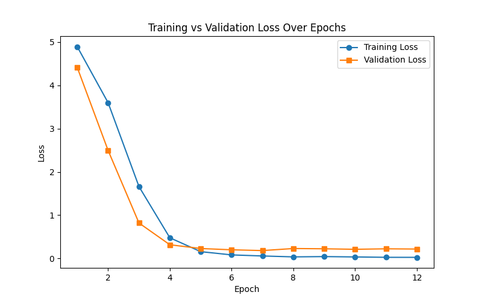

# NLP Intent Recognition Module Design and Evaluation Report

## Table of Contents

- [1. Business Requirement Analysis](#1-business-requirement-analysis)  
  - [1.1 Business Background and Objectives](#11-business-background-and-objectives)  
  - [1.2 Model Selection Justification](#12-model-selection-justification)
- [2. Dataset](#2-dataset)  
  - [2.1 Dataset Description](#21-dataset-description)  
  - [2.2 Preprocessing Workflow](#22-preprocessing-workflow)  
  - [2.3 Text Anonymization and Privacy Protection Research](#23-text-anonymization-and-privacy-protection-research)  
- [3. Model](#3-model)  
  - [3.1 Preliminary Research on TensorFlow Extended (TFX) and MLOps](#31-preliminary-research-on-tensorflow-extended-tfx-and-mlops)  
    - [3.1.1 Core Value of TFX](#311-core-value-of-tfx)  
    - [3.1.2 Key TFX Components](#312-key-tfx-components)  
    - [3.1.3 TFX Use Case for NLP Intent Classification](#313-tfx-use-case-for-nlp-intent-classification)  
  - [3.2 Model Architecture](#32-model-architecture)  
  - [3.3 Training Details](#33-training-details)  
- [4. Performance Evaluation](#4-performance-evaluation)  
  - [4.1 Overall Test Set Evaluation](#41-overall-test-set-evaluation)  
  - [4.2 Evaluation by Input Length](#42-evaluation-by-input-length)  
  - [4.3 Inference Speed](#43-inference-speed)  
- [5. Model Packaging and Deployment](#5-model-packaging-and-deployment)  
  - [5.1 API Design](#51-api-design)  
  - [5.2 Optimization Strategies for Large-Scale Deployment](#52-optimization-strategies-for-large-scale-deployment)  
  - [5.3 Preliminary Considerations for Bias Detection and Mitigation](#53-preliminary-considerations-for-bias-detection-and-mitigation)  

---

## 1. Business Requirement Analysis

### 1.1 Business Background and Objectives

In Google's product ecosystem, user input in natural language can be highly diverse and ambiguous. To improve the system's ability to automatically understand user queries, we aim to build an **intent classification module** capable of accurately identifying user intent and triggering the correct downstream automation logic.

Key goals of the module include:
- High accuracy in identifying common user intents
- Scalability to support future intent categories
- Fast inference speed suitable for production deployment

### 1.2 Model Selection Justification

This project adopts **BERT (Bidirectional Encoder Representations from Transformers)** from Hugging Face Transformers, using its TensorFlow version (`TFBertForSequenceClassification`) for downstream fine-tuning.

In the initial research phase, the following candidate models were also evaluated:

| Model         | Pros                             | Limitations                            |
|---------------|----------------------------------|-----------------------------------------|
| DistilBERT    | Fast inference, smaller size     | Slightly weaker than BERT in accuracy   |
| ALBERT        | Parameter sharing, memory efficient | Slower convergence, less ideal for small datasets |
| RoBERTa       | Strong pretraining, stable results | Larger size, higher training cost       |
| TF-IDF + SVM  | Simple and fast implementation   | Weak generalization and poor adaptability |

**Final choice**: **BERT-Base (TensorFlow version)** is selected as the optimal balance between performance and engineering cost. The system design also leaves room for future optimization through **model distillation** and **accelerated deployment**.


---

## 2. Dataset

### 2.1 Dataset Description

This project uses the **"plus" version of the CLINC150 dataset** as the benchmark for intent classification. The dataset is designed for real-world NLU (Natural Language Understanding) applications, simulating user queries in domains such as banking, e-commerce, travel, etc.

| Subset     | #Samples | #Classes | Samples per Class         |
|------------|----------|----------|---------------------------|
| Train      | 15,250   | 151      | 100 (250 for intent 42)   |
| Validation | 3,100    | 151      | 20 (100 for intent 42)    |
| Test       | 5,500    | 151      | 30 (1,000 for intent 42)  |

### 2.2 Preprocessing Workflow

1. **Data Loading**  
   We load the CLINC150 (plus) dataset using the `datasets` library. Since class `intent=42` is highly imbalanced compared to others, we remove all samples with this label. The resulting dataset contains **150 intent classes**.

2. **Tokenizer Encoding**  
   Use Hugging Face's `AutoTokenizer` with `bert-base-uncased` to tokenize input text:
   - WordPiece encoding  
   - Truncation to `max_length=32`  
   - Padding to ensure uniform input shapes

3. **Convert to TensorFlow Dataset**  
   Use `to_tf_dataset()` to convert the `DatasetDict` into a `tf.data.Dataset`, which is then used for model fine-tuning.

### 2.3 Text Anonymization and Privacy Protection Research

User-generated datasets often contain sensitive information such as names, addresses, phone numbers, and health status. Text anonymization is crucial for building **trustworthy AI systems**.

#### 2.3.1 Text Anonymization / PII Removal

PII anonymization refers to identifying and removing **personally identifiable information** such as names, locations, phone numbers, and IDs.

Common methods:
- **NER + Replacement**: Use NER models (spaCy, Stanza, BERT-NER) to detect entities, then replace them with placeholders.
- **Regex + Blacklist**: Identify structured PII like emails, phone numbers, URLs using patterns.

These approaches preserve sentence structure while removing sensitive content, and are easy to deploy for shared datasets and model fine-tuning.

#### 2.3.2 Differential Privacy in NLP

Differential privacy (DP) adds **noise to training** to prevent attackers from determining whether a specific user sample was used. It protects against memorization in models.

Techniques:
- **DP-SGD**: Add noise and apply gradient clipping during training using tools like **Opacus** or **TensorFlow Privacy**.
- **Private Language Modeling**: Differential privacy in models like BERT, ensuring no user data leakage even if the model is exposed.

DP is especially useful for sensitive corpora like chat logs, medical records, and search histories.

---

## 3. Model

### 3.1 Preliminary Research on TensorFlow Extended (TFX) and MLOps

**TensorFlow Extended (TFX)** is Google's open-source end-to-end machine learning platform designed to transition ML models from development to production, supporting continuous training, automatic validation, and monitoring. It is the external version of Google's internal MLOps toolchain and enables scalable, automated, and repeatable ML lifecycle management.

#### 3.1.1 Core Value of TFX

- TFX enables highly automated and reproducible pipelines by breaking down ML workflows into modular, composable components—from training to validation and deployment.
- It includes built-in model quality assurance tools (e.g., automatic data validation and model comparison), helping prevent performance degradation due to data drift.
- TFX supports production-scale deployment and integrates seamlessly with **Google Cloud (e.g., Vertex AI Pipelines)** and platforms like **Kubeflow**.
- It supports **continual training**, model versioning, and **A/B testing**, aiding long-term operations.
- The framework also allows integration with **privacy protection** and **review pipelines**, helping enterprises meet compliance and safety requirements for AI deployment.

#### 3.1.2 Key TFX Components

| Component         | Description                                                  |
|-------------------|--------------------------------------------------------------|
| `ExampleGen`      | Reads raw data sources (CSV, TFRecord, BigQuery, etc.)       |
| `StatisticsGen`   | Automatically generates feature statistics                    |
| `SchemaGen`       | Infers data schema (type, range, missing values)             |
| `ExampleValidator`| Detects anomalies in the dataset                              |
| `Transform`       | Applies feature engineering (e.g., normalization, tokenization)|
| `Trainer`         | Defines and trains a TensorFlow model                         |
| `Evaluator`       | Evaluates model performance based on metrics                  |
| `Pusher`          | Deploys the model to production environments                  |

#### 3.1.3 TFX Use Case for NLP Intent Classification

In the intent recognition system built with BERT, TFX can support training and evaluation workflows:

- **Data Processing:**
  - Use `ExampleGen` to load intent classification data (e.g., CLINC150 dataset); 
  - Use `StatisticsGen` and `ExampleValidator` to check label distribution and feature quality;
  - Use `Transform` to perform text normalization, tokenization, etc.

- **Model Training:**
  - Use `Trainer` to fine-tune the `TFBertForSequenceClassification` model.

- **Model Evaluation:**
  - Use `Evaluator` to compute accuracy and F1-score, and compare with previous models.

- **Model Deployment:**
  - Use `Pusher` to deploy the model to TensorFlow Serving or Vertex AI Prediction.
  - Coupled with CI/CD pipelines, user data collected daily can be used for retraining, and model versions can be updated after passing evaluation.

>  Note: Since TFX has limited support on Windows (full functionality requires Linux), this project currently uses **TensorFlow + HuggingFace + FastAPI**, and TFX integration will be considered in the deployment phase.

### 3.2 Model Architecture

The system uses Hugging Face’s `TFBertForSequenceClassification` based on the `bert-base-uncased` model, with a softmax classification layer on top.

- **Encoder**: 12-layer Transformer encoder (110M parameters)  
- **Pooling**: Use the `[CLS]` token’s output  
- **Classifier**: Fully connected layer projecting to `num_labels` logits

The output layer produces unnormalized logits, and the loss is computed using:

```python
loss_fn = tf.keras.losses.SparseCategoricalCrossentropy(from_logits=True)
```

### 3.3 Training Details

| Parameter               | Value                                     |
|--------------------------|-------------------------------------------|
| Fine-tuning Framework    | Hugging Face Transformers + TensorFlow   |
| Pretrained Model         | `bert-base-uncased`                      |
| Learning Rate            | 5e-5                                     |
| Batch Size               | 32                                       |
| Max Sequence Length      | 32                                       |
| Training Epochs          | Up to 100 with early stopping            |
| Early Stopping Strategy  | Stop if no validation improvement after 5 epochs |
| Optimizer                | AdamW with warmup                        |
| Warmup Steps             | 10% of total steps                       |

---

## 4. Performance Evaluation

<div align="center">
  <br>
  <b>Figure 1:</b> Training and Validation Loss
</div>

After epoch 5, a clear overfitting phenomenon emerged: validation loss stopped improving while training loss continued to decrease.

### 4.1 Overall Test Set Evaluation

| Metric    | Micro / Overall | Macro Avg | Weighted Avg |
|-----------|------------------|------------|----------------|
| Accuracy  | 0.959 (95.9%)    | —          | —              |
| Precision | —                | 0.961      | 0.961          |
| Recall    | —                | 0.959      | 0.959          |
| F1-Score  | —                | 0.959      | 0.959          |

The evaluation shows strong consistency across all 150 intent classes. Only a few classes (e.g., ID = 68, 89, 150) have F1-scores around 0.87–0.89, which is still acceptable. The fine-tuned model satisfies most industrial requirements for intent classification. For underperforming classes, further improvements could be made using **focal loss** or **resampling techniques**.

### 4.2 Evaluation by Input Length

| Bucket           | Sample Count | Accuracy | Macro F1 |
|------------------|---------------|----------|----------|
| Short (≤ 5 words) | 881           | 97.0%    | 0.943    |
| Medium (6–12)     | 3,190         | 95.7%    | 0.956    |
| Long (> 12)       | 429           | 95.3%    | 0.890    |

The model performs most stably on short inputs with 97% accuracy. Long inputs show a slight drop but remain above 95%. Further improvements could involve:
- Increasing `max_length` to 64
- Applying **text-span truncation** or **sliding window strategies**
- Using a more robust model that handles long inputs better

### 4.3 Inference Speed

- Input: `"how do I cancel my order"`
- Repeated: 100 times
- **Average inference time: ≈ 102.07 ms/sample**

---

## 5. Model Packaging and Deployment

### 5.1 API Design

| Field         | Description                                      |
|---------------|--------------------------------------------------|
| Base URL      | `https://<your-domain>/v1`                       |
| Resource Name | `intents`                                        |
| Main Endpoint | `POST /v1/intents:predict`                       |
| Protocol      | HTTPS + JSON (UTF-8)                             |
| Error Model   | `google.rpc.Status`                              |
| Implementation | Refer to `app.py` and OpenAPI `.yaml` file     |

 ### 5.2 Optimization Strategies for Large-Scale Deployment

The prototype system shows an average latency of ~102 ms/sample, which is acceptable for low-QPS settings. For production-scale services at Google-level scale, improvements in throughput, cost, and scalability are essential.

**Model Optimization:**
- Replace BERT-base with lighter distilled models such as **DistilBERT** or **TinyBERT**

**Inference Engine Optimization:**
- Convert TensorFlow model to **ONNX**
- Accelerate using **ONNX Runtime** or **TensorRT**

**Deployment Optimization:**
- Enable **XLA compilation** or **TF-TRT** with mixed precision (FP16/INT8)
- Use **dynamic batching**, **async inference**, and **autoscaling**


### 5.3 Preliminary Considerations for Bias Detection and Mitigation

The CLINC150 dataset is balanced and uniformly distributed post-preprocessing, showing no obvious surface-level topic bias. However, real-world inputs exhibit diversity in region, gender, and other dimensions.

**Bias Detection:**
- Use **Embedding Association Test (EAT)** or **SEAT benchmarks** to identify potential systematic bias

**Bias Mitigation Strategies:**

- **Data Augmentation:**
  - Use back-translation, synonym replacement, or oversampling for underrepresented groups

- **Training Adjustment:**
  - Apply **re-weighting** or **adversarial debiasing** to reduce reliance on sensitive features

- **Inference Control:**
  - Apply **confidence thresholding** or **penalized calibration** to softly protect vulnerable groups

- **Monitoring:**
  - Integrate **online bias detection** and alerting into the MLOps pipeline to manage long-term risks

